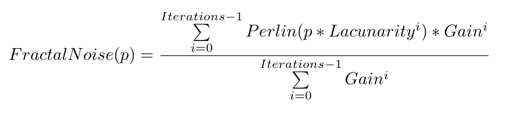

# Noise-map-generator
Online noise texture generator. Check out at https://xallt.github.io/Noise-map-generator/

# Description
The initial noise texture is created by summing up [Perlin noise](https://en.wikipedia.org/wiki/Perlin_noise) with different weights resulting in **Fractal noise**.

Then a texture generated by the same algortihm is used for distortion.
# Parameters

|Name||
|---|---|
|**Resolution**|The resolution with which the texture will be downloaded|
|**Channels**|How many different noise textures to use in the output texture. Setting this to 3 will result in the image contaning 3 different noise textures in **Red**, **Green**, and **Blue** channels|
|**Octaves**|Number of iterations for Fractal noise|
|**Scale**|Initial scaling for Perlin noise|
|**Gain**|*Corresponding value in the formula*|
|**Lacunarity**|*Corresponding value in the formula*|
|**Distortion strength**|How much the distortion texture affects the initial noise|

